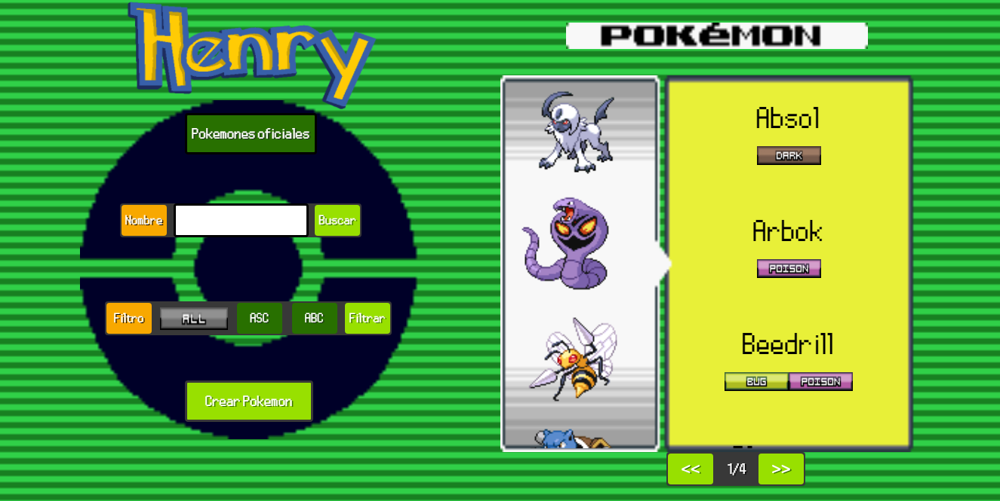
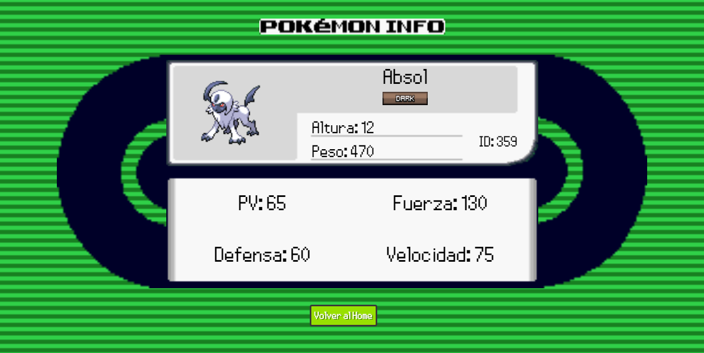
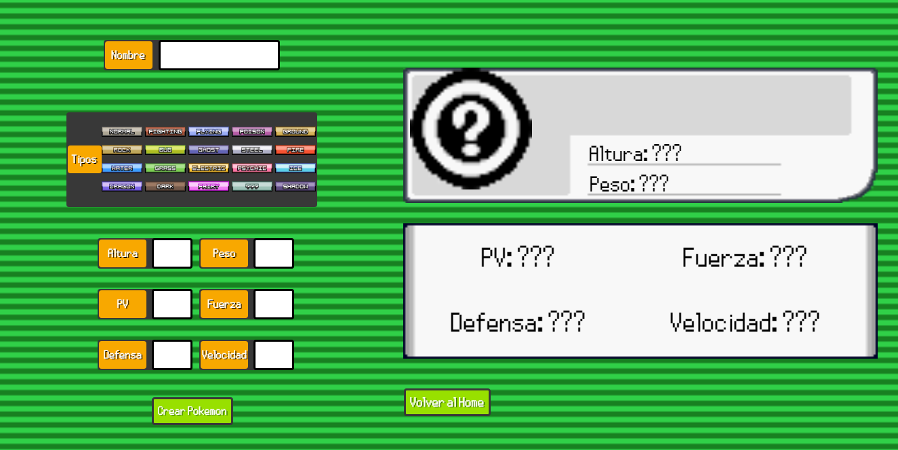

# PI-Pokemon-FT13

### A website made to show pokemons on a list, filter them if necessary, show more info on a selected pokemon and even create your own pokemon
###
### The website will be deployed in the near future

### Made with:
+ React
+ Redux
+ Express
+ Sequelize

#### Home Page

This page counts with the ability to filter pokemons by name or types, and order them by alphabet or attack stat, be it ascending or descending. 
By pressing the first button, you can change between searching oficial pokemons, or pokemons created by the user, and you can use the previously discussed filter on your created pokemons. 
The 'Types' button can be clicked to go fowards through the types, and right-clicked to go backwards. 
The list of pokemons is paginated, with a max of 12 pokemons per page. 
When you click on a pokemon, it will take to a page that includes that pokemon's info, and 'Crear Pokemon' takes you to a page with a form with which you can create your own pokemons   

#### Pokemon Info

Here, you will see the selected pokemon's name, type, size, weight, id, HP (Hit Points), Attack, Defense, and Speed stats, with a button to go back to 'Home'  

#### Create Pokemon

In this page, there is a form that allows you to create pokemons, and on the right there a preview of the pokemon you are creating. 
The form has checks so the creator doesnt create a nameless pokemon, a typeless pokemon, or a pokemon with more than 2 types. 
When you are done creating your pokemon, you press the 'Crear Pokemon' button, and it is saved on the database, you can now go to Home and see your pokemon by pressing the first button,
and they even have their own 'Pokemon Info' page.

## Quick Start

+ Clone repository
+ Run the next two commands:
  + npm install
  + npm start   in /client and /api in two different consoles
+ Open http://localhost:3000 in your browser
